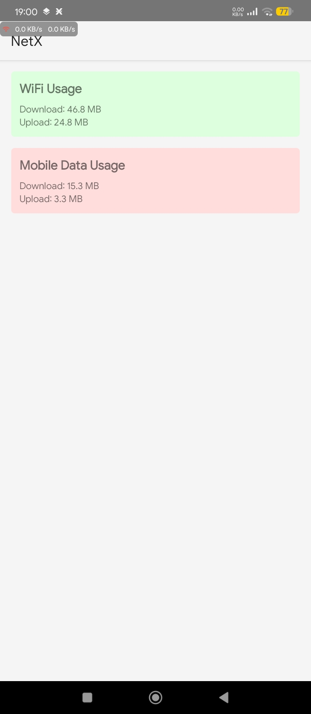
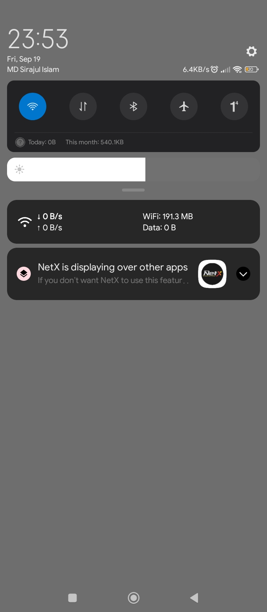

<h1 align="center">NetX - Internet  Speed Monitor</h1>

  

<b>NetX</b> is a lightweight Android application that allows you to monitor your real-time internet speed with a floating overlay and dynamic notification.  

 NetX also intelligently calculates and stores your <b>Wi-Fi</b> and <b>Mobile Data</b> usage separately, ensuring you have full insights into your data consumption.  

---

<h2 align="center">Feature's</h2>

- **Real-time Speed Monitoring**: Monitor download and upload speed instantly.  
- **Dynamic Icon Overlay**: Floating overlay icon that changes dynamically based on your current internet speed.  
- **Data Usage Tracker**: Separately logs and displays Wi-Fi and Mobile data usage.  
- **Persistent Notification**: Fixed notification displaying live internet speed and data usage details.  
- **Optimized Performance**: Runs efficiently in the background with minimal battery and memory usage.  
- **Clean UI**: Simple, native design without heavy libraries.

---

<h2 align="center">Preview</h2>

  
  &nbsp;&nbsp;
  

---

<h2 align="center">Installation</h2>

1. Download the latest release from the [Releases](https://github.com/MSI-Sirajul/NetX/releases) section.  
2. Install the APK on your Android device.  
3. Grant the required **Overlay Permission** to allow NetX to display speed on top of other apps.  
4. Enable background running permission (if required by your device brand).  

---

<h2 align="center">Permissions</h2>

- **`SYSTEM_ALERT_WINDOW`** → Required for displaying floating overlay speed indicator.  
- **`INTERNET`** → To monitor network traffic.  
- **`ACCESS_NETWORK_STATE`** → To check active network status.  
- **`ACCESS_WIFI_STATE`** → To track Wi-Fi data usage.  
- **`READ_PHONE_STATE`** → To detect mobile data usage accurately.  
- **`FOREGROUND_SERVICE`** → To run persistent notification and monitor speed in background.  

---

<h2 align="center">How It Works</h2>

NetX continuously monitors the network traffic and calculates the real-time upload and download speed. The floating overlay displays speed in a compact dynamic icon, while the persistent notification provides a detailed breakdown of network usage. Data usage is stored separately for Wi-Fi and Mobile networks, so you always know how much you’ve consumed.  

---

## My Skill🛠️

       
 
 
         

---

<h2 align="center">📌 Roadmap</h2>

- Dark mode support 🌙  
- Customizable notification style 🎨  
- Data usage history & export option 📑  

---

<h2 align="center">🤝 Contributing</h2>

Contributions, issues, and feature requests are welcome! Feel free to open a pull request or start a discussion in the issues section.  

---

<h2 align="center">📜 License</h2>

This project is licensed under the **MIT License** - see the [LICENSE](LICENSE) file for details.  

